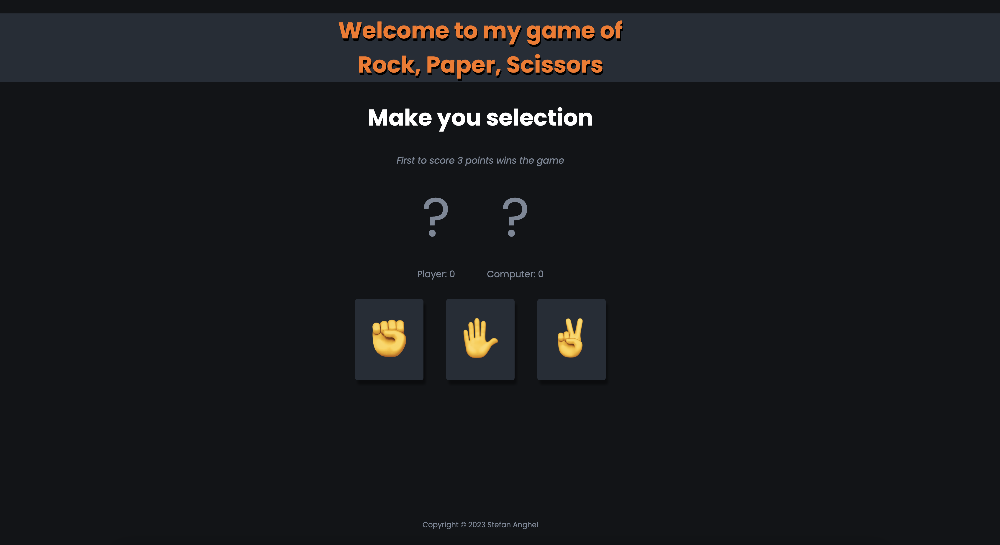
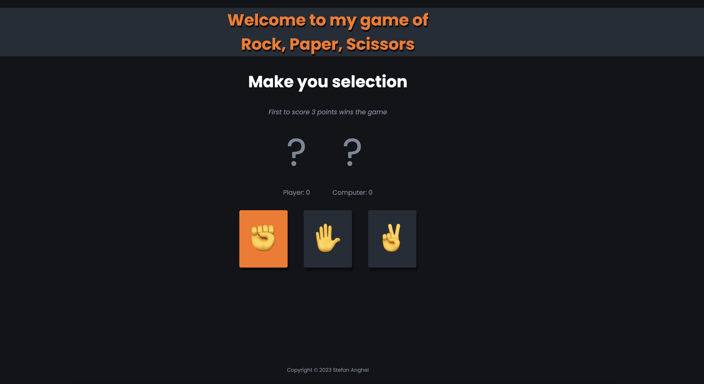
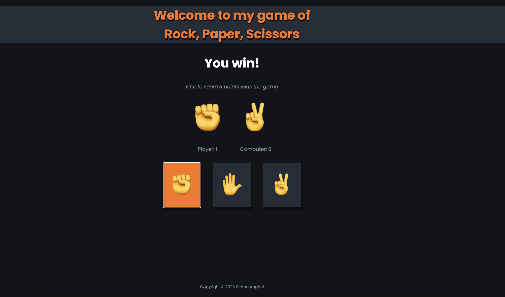
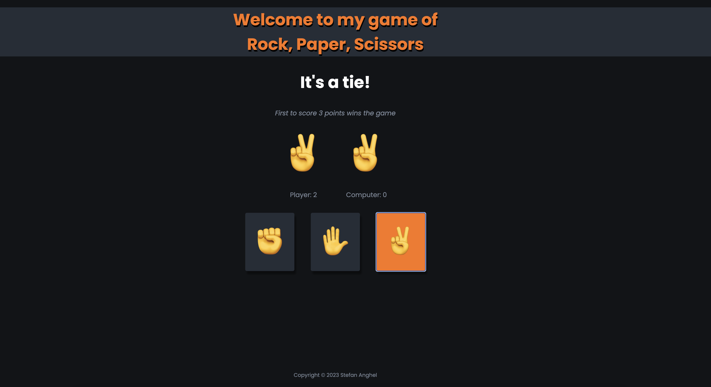
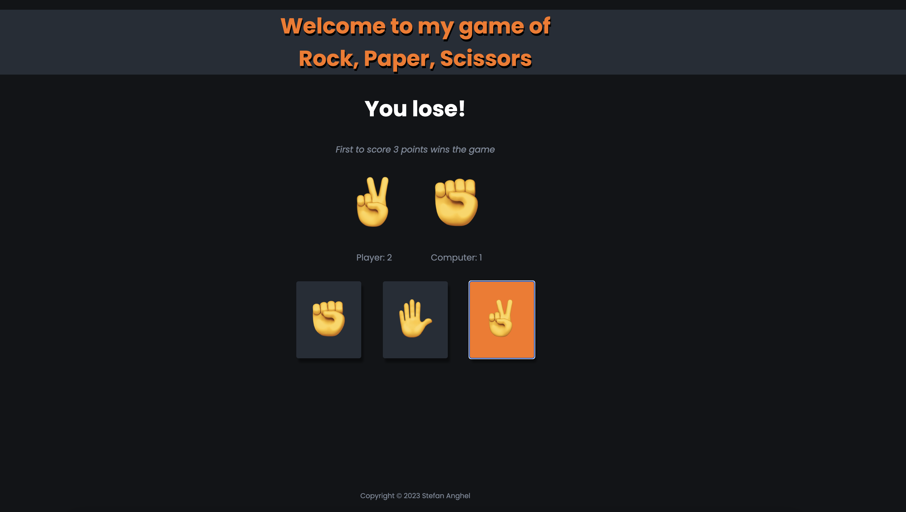
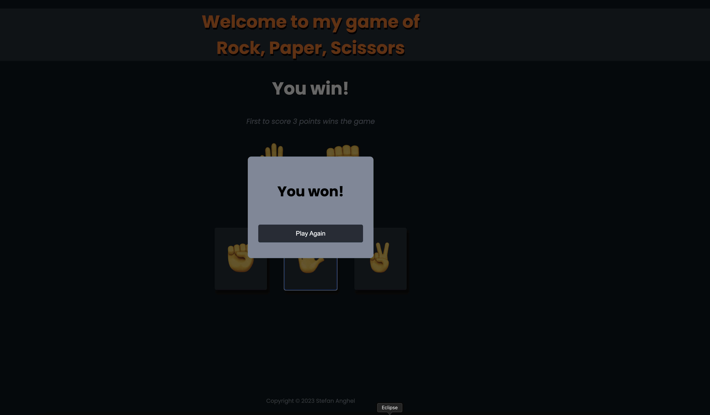
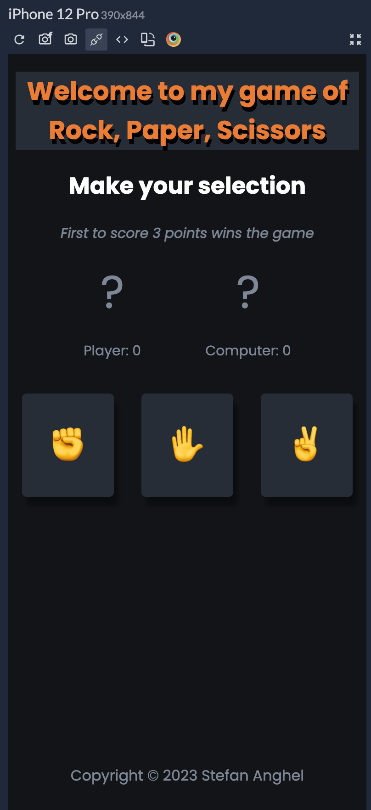
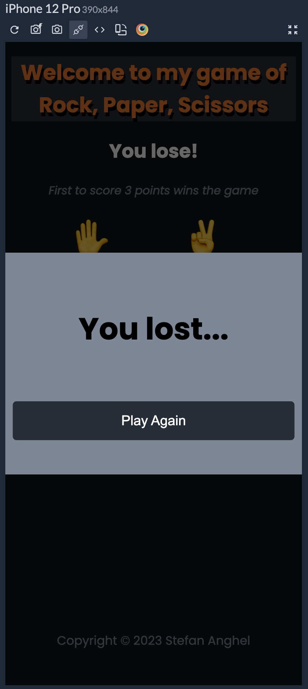

#  Personal website

Rock, Paper, Scissors game: This GitHub repository contains the HTML, CSS and JavaScript code for my game of Rock, Paper, Scissors showcasing my web development skills.

## Table of contents

- [Overview](#overview)
  - [The challenge](#the-challenge)
  - [Screenshot](#screenshot)
  - [Links](#links)
- [My process](#my-process)
  - [Built with](#built-with)
  - [What I learned](#what-i-learned)
  - [Continued development](#continued-development)
- [Author](#author)

## Overview

### The challenge

Users should be able to:

- View the optimal layout for the website depending on their device's screen size
- See hover states for all interactive elements on the page
- Chosse a weapon to play against the computer by pressing on one of each three hand buttons
- See their current selection and computer selection
- See the live score of the game
- See a message displayed if they won or lost a particular round or if it's a tie
- Get a popup window displaying if the they won or lost the game
- Reseting the game after it's finished and playing again

### Screenshot

### Links

- Live Site URL: [Rock, Paper, Scissors](https://stefananghel93.github.io/rock-paper-scissors/)

## My process

### Built with

- HTML5 markup
- CSS
- JavaScript

### What I learned

JavaScript functions and functions callbacks
How to change the UI based on the events that happen
How to use event listeners

### Continued development

I will continue to learn new skills and develop further by building more personal and unique projects which will soon get me to my goal of becoming a web developer.

## Author

- Website - [Stefan Anghel](https://stefananghel93.github.io/personal-website/)
- Github - [Stefan Anghel](https://github.com/stefananghel93)
- LinkedIn - [Stefan Anghel](https://www.linkedin.com/in/stefan-anghel/)

